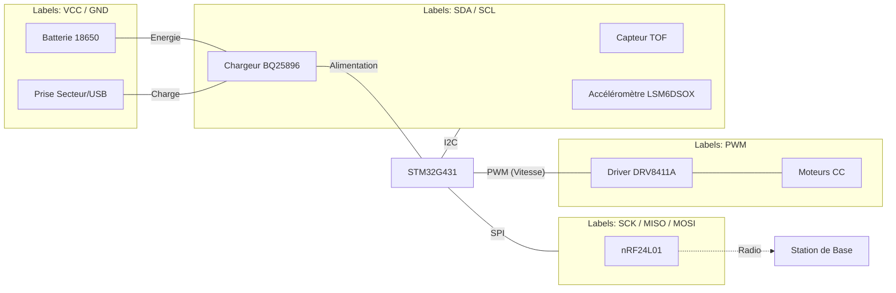

# Diagramme + Bus I2C et Bus SPI

#### BUS I2C :

https://www.yoctopuce.com/FR/article/petite-introduction-au-bus-i2c

https://youtu.be/15XY4LoQyjc?si=3IJ6fjEveq3ZDlDo

#### BUS SPI :

https://lycrouv-sn.fr/rsc/TdTp/Td/ciel2/Datalink/res/bus_spi.pdf

https://youtu.be/2hnIKzI6yYE?si=DDTpKShhfTgUhP8

